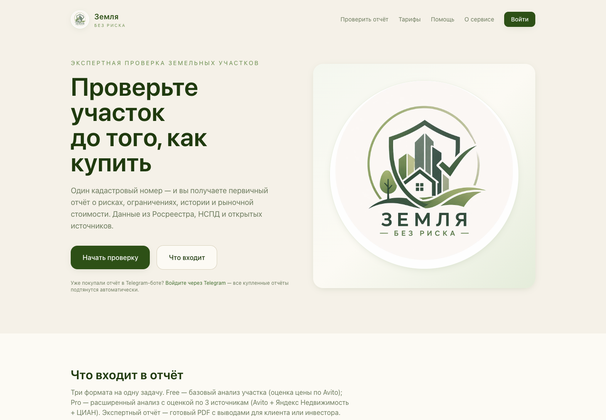

# Yandex Realty Parser

Закрытый компонент CodoCeh для обработки рыночных аналогов из объявлений Яндекс.Недвижимости. Используется в оценочном контуре сервисов о земельных участках.

## Задача компонента

- получает карточки доступных объявлений;
- нормализует параметры объекта, цену, географический контекст и дату;
- отбрасывает неполные и нерелевантные результаты;
- передаёт подготовленные аналоги в расчёт ориентировочной цены участка.

## Где применяется

Пользовательский результат доступен через [Земля без риска check](https://zbrcheck.ru). Компонент не является самостоятельным публичным приложением и не предоставляет открытый API.

## Статус исходного кода

Это публичная карточка продукта CodoCeh. Исходный код, конфигурация, ключи интеграций, данные объявлений и рабочие сборки здесь не публикуются.
